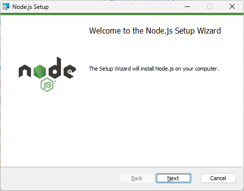

# Node.js 環境をセットアップ

creation date：July 21th in 2024
update

## Node.jsをインストールする

Install Version：20.15.1・LTS

ここでは、ビルド済みインストーラーをダウンロードします。
`☁ Download Node.js v**.**.*` アイコンをクリック。（`v**.**.*` はNode.Jsのバージョン）

ダウンロードしたインストーラー(msiファイル)`node-v**.**.*-x64.msi` を起動します。

インストーラーが起動したら、`Next`をクリックします。

"Node.js is licensed for use as follows:"の内容を確認し、"I accept the terms in License Agreement"をチェック、`Next`をクリックします。

インストール先のディレクトリーを設定します。変更する必要がなければそのまま`Next`をクリックします。
（変更する場合は、ディレクトリーを直接記入するか、`Change...`をクリックしディレクトリーを指定します。）

インストール内容をカスタムします。
デフォルト設定の場合は、そのまま`Next`をクリックします。

チェックボックスにチェックを入れます。
※チェックを入れることで、Node.jsを利用するときに別途必要な様々なツールが、Node.jsインストール完了後に自動インストールされます。

`🛡Install` をクリックします。

ユーザーアカウント制御が表示されたら`はい`をクリックします。
インストールがはじまります。

インストールが完了すると以下の画面が表示されます。
`Finish`をクリックすると、コマンドプロンプトが表示されます。

適当にキーを押します。

キーを押します。

PowerShellを起動するユーザーアカウント制御が表示をされたら`はい`をクリックします。

## Node.jsのバージョン確認

コマンドプロンプトを起動します。  
`Node -v`を入力し、`⏎ Enter`を押します。

ヴァージョンが表示されます（画面の例では、v20.15.1）

