# Gitのインストール

## Gitにアクセス

[gitforwindows](https://gitforwindows.org/)

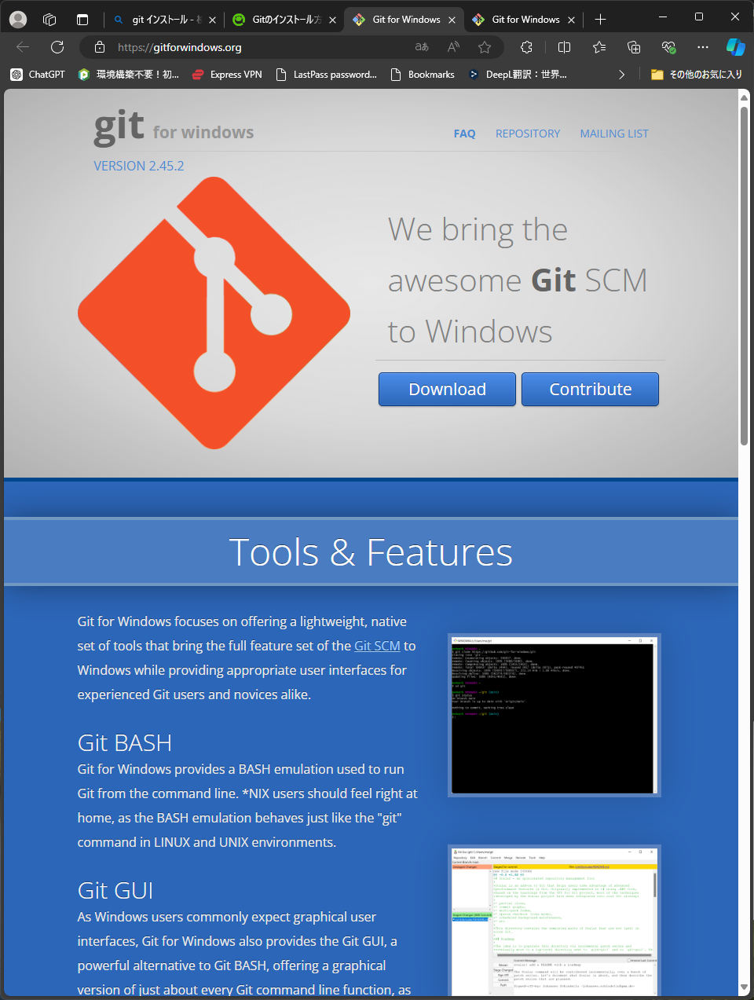

インストーラーを起動します。

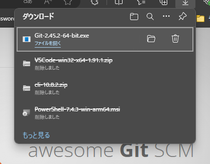

ユーザーアカウント制御が表示されたら`はい`をクリックします。

`Next`をクリックします。

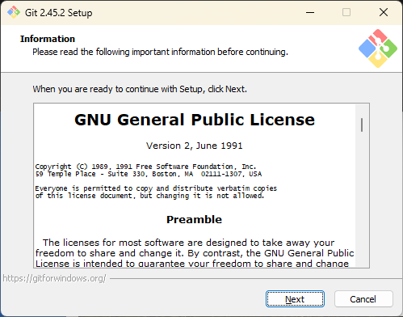

`Next`をクリックします。

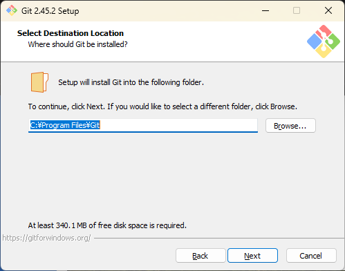

コンポーネントの選択
デフォルト設定のまま進める
`Next`をクリックします。

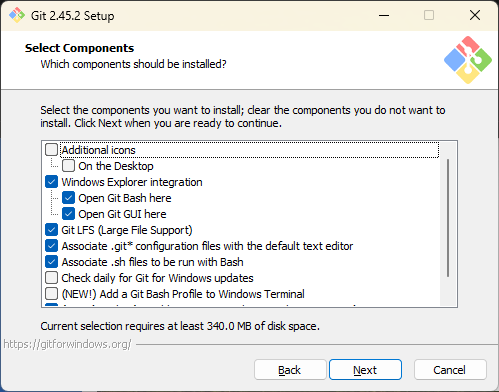

インストールフォルダーを
`Next`をクリックします。

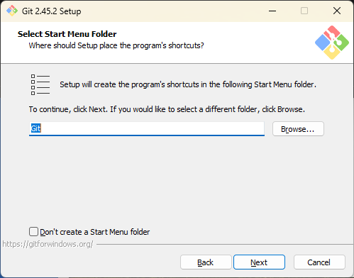

`Next`をクリックします。

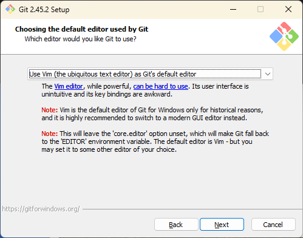

`Next`をクリックします。

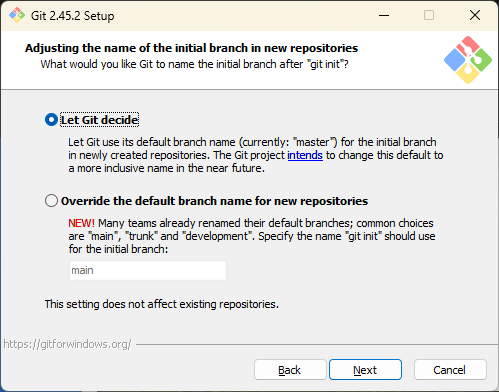

`Next`をクリックします。

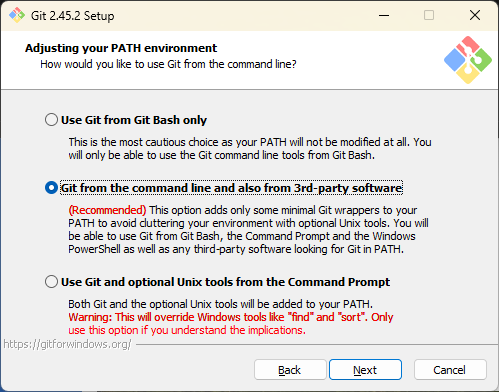

`Next`をクリックします。

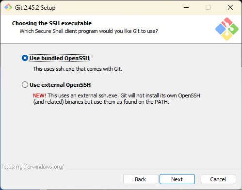

`Next`をクリックします。

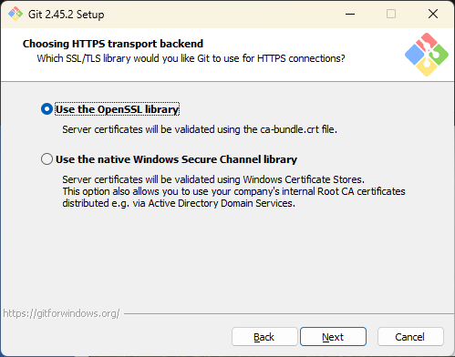

`Next`をクリックします。

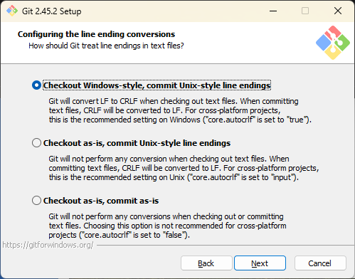

`Next`をクリックします。

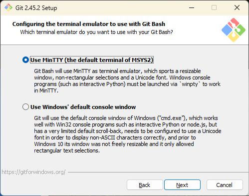

`Next`をクリックします。

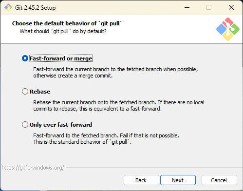

`Next`をクリックします。

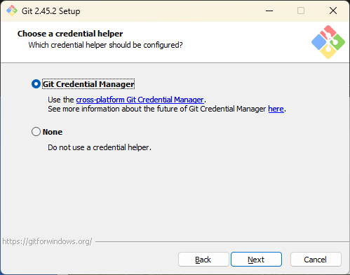

`Next`をクリックします。

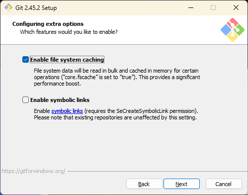

`Install`をクリックします。

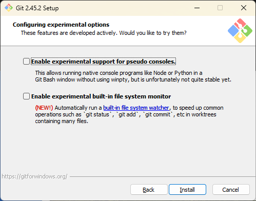

インストールがはじまります。

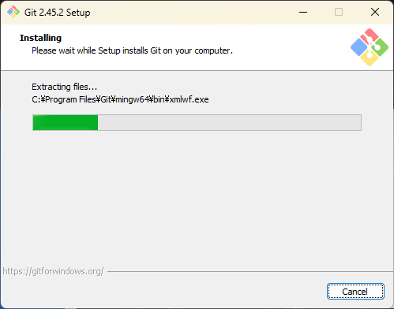

インストール完了です。`Finish` をクリックします。

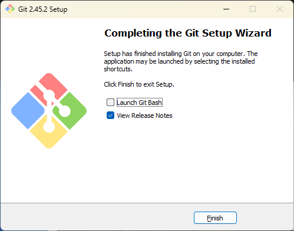

コマンドプロンプトでインストールが完了していることを確認します。

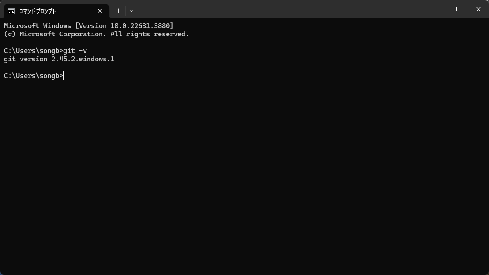

### Gitのユーザー設定

```cmd
PS C:\Users\*****\codesysfx2-project> git config --global user.email "songbird.abeam7783@outlook.jp"
PS C:\Users\*****\codesysfx2-project> git config --global user.name "Tsugumi Yamada"
```

VS Codeのターミナルからメールアドレスとユーザー名を登録します。

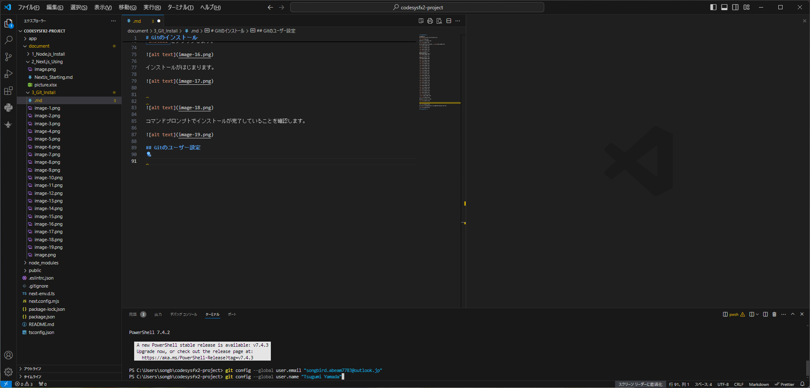

### Gitリポジトリ―の作成

※ 初回のみの作業
git initコマンドを使用して初期設定を行います。
ターミナルに`git init`を入力し実行します。

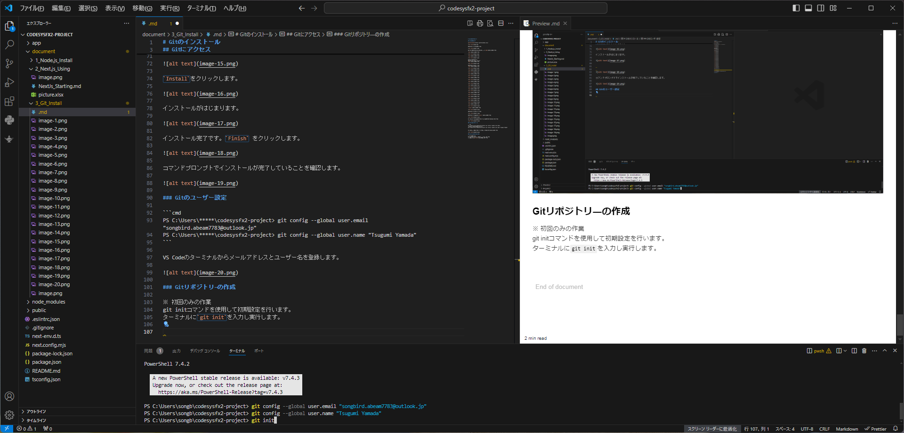

Gitの履歴に登録されていないファイルの色が変化します。

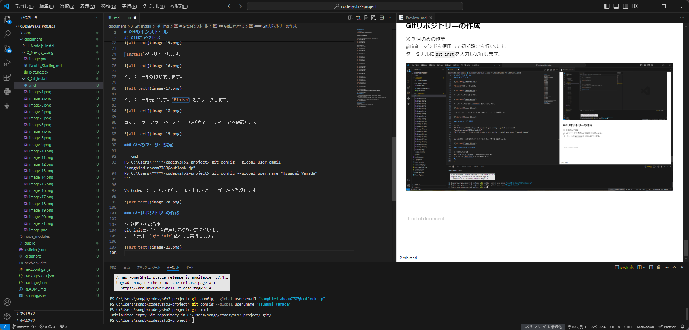
※ U： untracked

